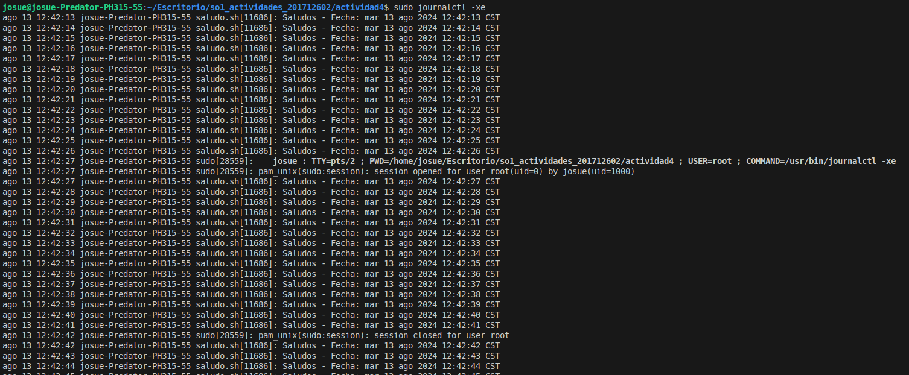

# Creacion del script
Creamos el script, en este caso con el nombre `saludo.sh`
```bash
#!/bin/bash

while true
do
  echo "Saludos - Fecha: $(date)"
  sleep 1
done

```
Verificamos que el script tenga permisos de ejecucion
```bash
chmod +x ruta_del_script
```

# Creacion de un servicio en systemd
Creamos un archivo en el directorio `/etc/systemd/system/`
```bash
    sudo nano /etc/systemd/system/saludo.service
```
El contenido del archivo sera el siguiente
```ini
[Unit]
Description=Servicio de saludo que imprime la fecha y hora actual
After=network.target

[Service]
ExecStart=/home/josue/Escritorio/so1_actividades_201712602/actividad4/saludo.sh
Restart=always

[Install]
WantedBy=multi-user.target
```
[Unit]: Contiene información básica sobre el servicio.
* Description: Descripción del servicio.
* After: Define el orden de inicio, en este caso, después del servicio de red.

[Service]: Configura cómo se ejecuta el servicio.
* ExecStart: La ruta al script que se debe ejecutar.
* Restart: Reinicia el servicio si se detiene.

[Install]: Define cómo y cuándo se debe iniciar el servicio.
* WantedBy: Especifica el target que el servicio se debe habilitar, en este caso, se habilita en el nivel multi-user.target.

# Inicio del servicio con el sistema
```bash
sudo systemctl daemon-reload
sudo systemctl enable saludo.service
sudo systemctl start saludo.service
```

Verificamos que el servicio este corriendo
```bash
sudo systemctl status saludo.service
```

# Consultar los logs del servicio
```bash
sudo journalctl -xe
```
