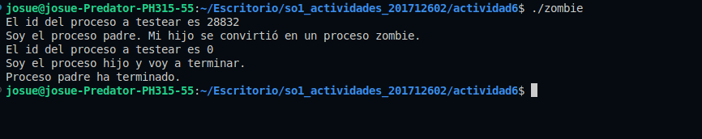
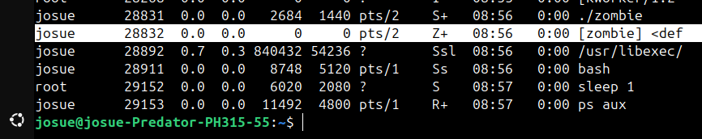

# Actividad 6 - Hoja de trabajo
## 1. ¿Incluyendo el proceso inicial, cuantos procesos son creados por el siguiente programa?, Razone su respuesta. 
```c
#include <stdio.h>
#include <unistd.h>

int main
{
    fork();
    fork();
    fork();

    return 0;
}
```

### Respuesta: 
Cada vez que usamos la funcion **fork()** invocamos la creacion de un nuevo proceso, sin embargo este se comporta de la siguiente manera ante 3 iteraciones:
- En la primera iteracion, un proceso padre crea un proceso hijo adicional
- En la segunda iteracion, tanto el proceso padre e hijo de la iteracion anterior crean un nuevo proceso.
- En la tercera iteracion, se crean nuevos procesos a partir de los 4 creados en la segunda iteracion.

En resumen
    
    1 padre -> 1 proceso hijo = 2 procesos

    1 padre (anterior) -> 1 proceso hijo && 1 hijo (anterior) -> 1 hijo = 4 procesos
    
    Por cada proceso se crea un hijo = 4*2=8

#### **En total se crean 8 procesos en las 3 iteraciones de la funcion forl().**

## 2. Utilizando un sistema Linux, escriba un programa en C que cree un proceso hijo (fork) que finalmente se convierta en un proceso zombie. Este proceso zombie debe permanecer en el sistema durante al menos 60 segundos. Los estados del proceso se pueden obtener del comando: ps -l
### Programa propuesto

```c
#include <stdio.h>
#include <stdlib.h>
#include <unistd.h>
#include <sys/types.h>
#include <sys/wait.h>

int main()
{
    pid_t pid = fork();

    if (pid < 0)
    {
        // Error al crear el proceso
        perror("Error al crear el proceso");
        exit(1);
    }

    printf("El id del proceso a testear es %d\n", pid);

    if (pid == 0)
    {
        // Proceso hijo
        printf("Soy el proceso hijo y voy a terminar.\n");
        exit(0); // El hijo termina, se convierte en zombie
    }
    else
    {
        // Proceso padre
        printf("Soy el proceso padre. Mi hijo se convirtió en un proceso zombie.\n");
        sleep(60); // Esperar 60 segundos para ver al proceso hijo como zombie
        printf("Proceso padre ha terminado.\n");
    }

    return 0;
}
```
### Los logs del programa deben ser los siguientes:



### Con el siguiente comando logramos ver el proceso en estado zombie
```bash
ps aux
```



## 3. Usando el siguiente código como referencia, completar el programa para que sea ejecutable y responder las siguientes preguntas:

### Propuesta de programa completo
```c
#include <stdio.h>
#include <unistd.h>
#include <pthread.h>

void* thread_func(void* arg) {
    printf("Hilo creado.\n");
    return NULL;
}

int main() {
    pid_t pid;

    pid = fork();
    if (pid == 0) { // Proceso hijo
        fork(); // Crear un proceso nieto
        pthread_t thread;
        pthread_create(&thread, NULL, thread_func, NULL); // Crear un hilo en el proceso hijo
        pthread_join(thread, NULL); // Esperar a que el hilo termine
    }

    fork(); // Otro fork en el proceso padre y procesos hijos/nietos

    return 0;
}
```

### * ¿Cuántos procesos únicos son creados?

- Al inicio del programa al llamar la funcion fork se crea un proceso padre con un proceso hijo
- Al entrar a la condicion se crea un proceso nieto 
- Al llegar a la funcion fork del final tenemos 1 padre, 1 hijo y 1 nieto
- Duplicamos la cantidad de procesos dandonos un total de **6 procesos unicos**.

### * ¿Cuántos hilos únicos son creados?
Unicamente si se hace el llamado en la condicion se crea **1 hilo unico**.