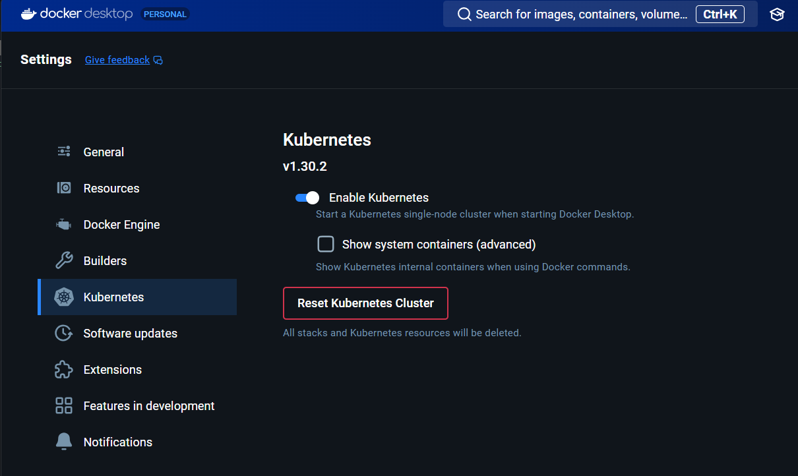
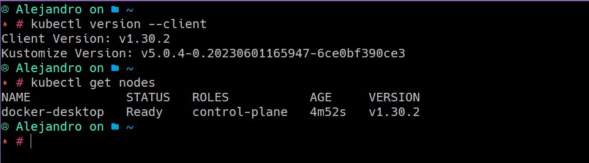
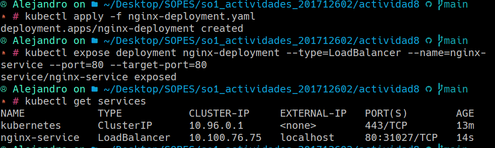
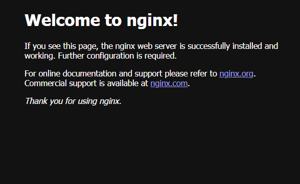

# Actividad 8

> ## Instalar un ambiente local de Kubernetes utlizando minikube, kind o Docker Desktop.

El ambiente local que usare sera el ofrecido por **Docker Desktop**.



Posterior a la activacion del servicio verificamos que este funcionando correctamente




> ## Desplegar un contenedor de algun web server, apache o nginx por ejemplo, en el Cluster de K8s Local.

Desplegamos el web server de NGINX [YAML file](nginx-deployment.yaml)

```bash
# Desplegar el deployment
kubectl apply -f nginx-deployment.yaml
# Exponer el servicio de NGINX
kubectl expose deployment nginx-deployment --type=LoadBalancer --name=nginx-service --port=80 --target-port=80
# Acceder al servidor de NGINX
kubectl get services
```



Accediendo al **PORT** indicado



> ## Contestar a siguiente pregunta.¿En un ambiente local de Kubernetes existen los nodos masters y workers, como es que esto funciona?

En un ambiente local de Kubernetes, como el proporcionado por Docker Desktop o Minikube, el clúster de Kubernetes se simplifica en una arquitectura de nodo único, pero simula tanto el master como los workers en un solo nodo.

1. ### Nodos Master y Worker en Kubernetes

* **Nodos Master**: En un clúster de Kubernetes tradicional, los nodos master son responsables de las tareas de control y coordinación del clúster. Ejecutan componentes clave como el API server, el scheduler (planificador), y el controller manager, que gestionan el estado del clúster, la distribución de pods, y la comunicación con los nodos worker.

* **Nodos Worker**: Los nodos worker ejecutan las aplicaciones (contenedores) y son los encargados de correr los pods. Cada nodo worker tiene componentes como el kubelet, que se comunica con el master, y el kube-proxy, que gestiona las redes internas.

2. ### Funcionamiento en un Ambiente Local
En un ambiente local como Docker Desktop o Minikube, todo el clúster (nodo master y worker) se ejecuta dentro de tu máquina en un solo nodo:

* **Nodo único**: Docker Desktop o Minikube crean un solo nodo que desempeña las funciones tanto de master como de worker. Esto significa que todos los componentes del control plane (API server, scheduler, etc.) y los servicios que ejecutan los contenedores están en ese mismo nodo.

* **Simulación de clúster**: Aunque hay un solo nodo, Kubernetes sigue funcionando de manera completa. Las aplicaciones se ejecutan como si estuvieran en un clúster distribuido, pero todo ocurre dentro de ese nodo local.

* **Componentes internos**: Docker Desktop y Minikube encapsulan los componentes de Kubernetes dentro de una máquina virtual o un contenedor que corre en tu máquina local, lo que permite que el nodo local se comporte como un mini-clúster.

3. ### Limitaciones de un Ambiente Local

* **Escalabilidad**: Dado que todo corre en un solo nodo, la capacidad para escalar y distribuir carga es limitada comparada con un clúster de producción distribuido en múltiples nodos.

* **Simplicidad**: Es ideal para desarrollo y pruebas locales, ya que permite simular el comportamiento de Kubernetes sin tener que desplegar en un entorno real distribuido.